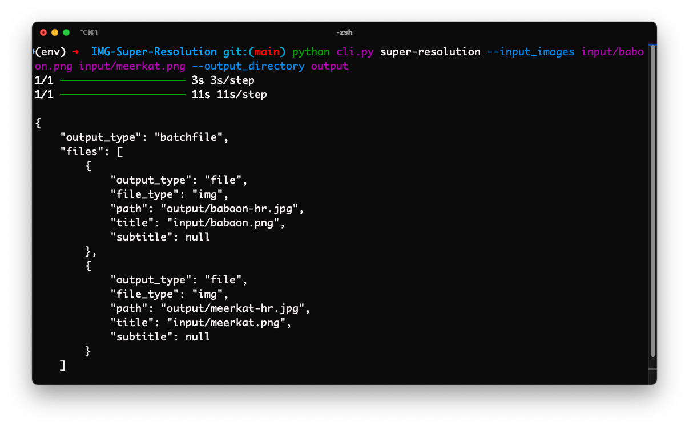

# IMG Super Resolution

This simple project aims to utilize an existing state-of-the-art pre-trained model to upscale low-resolution images to a higher resolution, which is known in the computer vision community as **image super resolution**. The model used here is a Residual-in-Residual Dense Network (RRDN), which is based on an ESRGAN architecture. More about the specific implementation in this project can be found in the following [repository](https://github.com/idealo/image-super-resolution).

## Installation Instructions

Make sure you have Python3 installed. Before installing dependencies, you may want to setup a virtual environment if you haven't already. Steps on how to do so using `venv` can be found [here](https://docs.python.org/3/library/venv.html). Follow these steps to setup and run the service:

1. **Clone the Repository:**

    ```bash
    git clone https://github.com/shriramg24/img-super-resolution.git
    cd img-super-resolution
    ```

2. **Install Dependencies:**

    ```bash
    pip install -r requirements.txt
    pip install --no-deps -r no-deps.txt
    ```

3. **Prepare Input Images:**

    Add any low-resolution images that need to be upscaled to the top-level of the `input` directory. You can also specify a different input directory by passing in a path as a command-line argument to the CLI tool (shown further below). All image files are expected to be in one of these formats: `.png`, `.jpg`, or `.jpeg`.

4. **Test Run the Application via CLI:**

    Make sure you are in the root directory, and run this command:

    ```bash
    python3 cli.py super-resolution --input_images input/baboon.png input/meerkat.png --output_directory output --weights gans --scale 4.0
    ```

    Note that you can change these CLI arguments as needed:
    - `input_images`: List of space separated input images (all in `.png`, `.jpg`, or `.jpeg` format).
    - `output_directory`: Path to a directory where the upscaled images should be stored.
    - `weights`: Refers to the model weights to use to upscale your images. Must be one of `gans`, `psnr-small`, `psnr-large`, or `noise-cancel`.
    - `scale`: Refers to how much bigger your image should be. Must be between 1.0 and 4.0 (inclusive).

    **Sample Results**:
    
